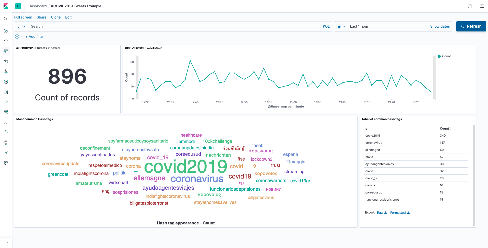

# Twitter stream to Elasticsearch Tutorial



## Requirements

* Docker
* docker-compose
* Make sure Docker Engine is allotted at least 4GiB of memory. In Docker Desktop, you configure resource usage on the Advanced tab in Preference (macOS) or Settings (Windows).
* Twitter API credential

### Recommended

* Visual Studio Code
* Docker extension for VS Code

## Getting started

To get started, type in your own Twitter API credentials in the `twitter_logstash.conf` file.

Open up a terminal window to the root of this folder. Run:
> NOTE: This might take a several of minutes, be patient

```sh
docker-compose up
```

This will launch an Elasticsearch cluster with three Elasticsearch instances and on Kibana instances running inside separate docker containers. You only need one instance of Elasticsearch but this tutorial will demonstrate simple scalability.

To shut down the cluster, run:

```sh
docker-compose down
```

You can use the docker extension for VS code to check that all of the containers are stopped.

When you want to remove the containers, images, persistent volumes and networks, run:
> NOTE! This will remove ALL containers, images, persistent volumes and networks on your system!

```sh
docker system prune -a
```

### Import the example dashboard

To get a better understanding of the data it often helps to visualize it. This can be done in Kibana with the Visualize tool where you can easily create different graphs and visualizations of the data that you indexed into ES. These visualizations can then be grouped into dashboards. Import the example dashboard by going to **Management -> Saved Objects -> Import -> And choose the export.ndjson from this repo**.

Go to The Dashboard tool on the left and you should see the example dashboard. If the visualizations don't look right, check if the date range is correct.
